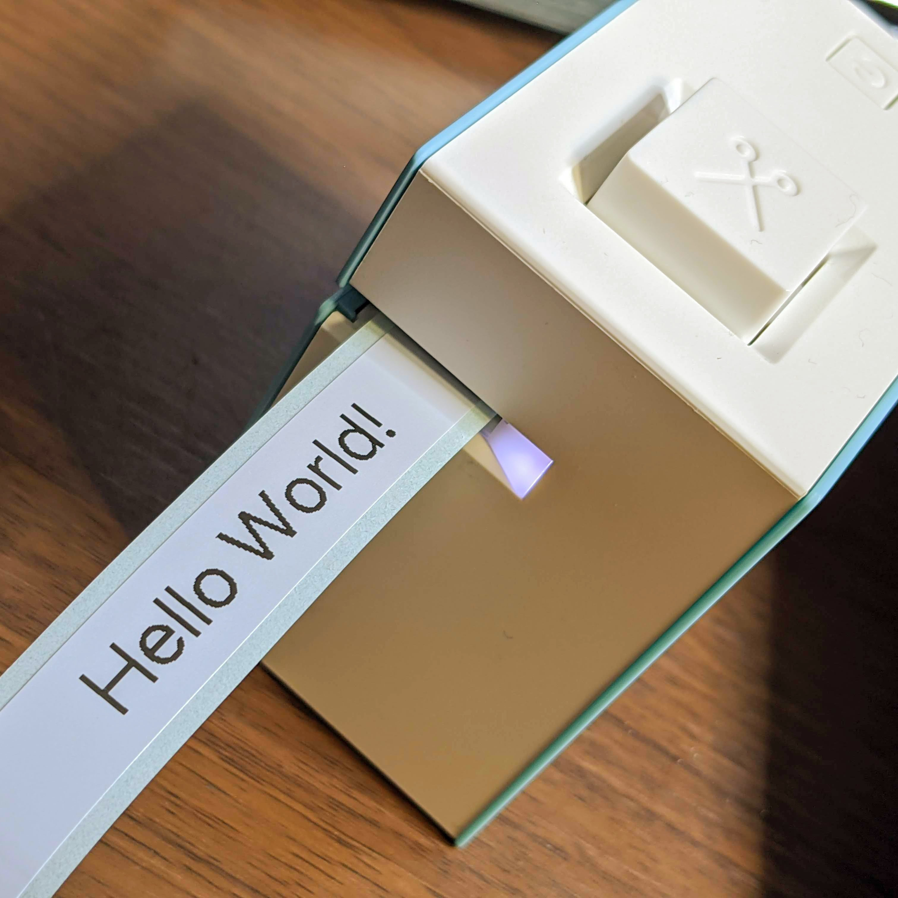

<div align="center">
  
  <h1>tepra-lite-esp32</h1>
  <i>MicroPython module to communicate with KING JIM TEPRA Lite LR30</i>
</div>


## Preface

This is a reverse-engineered module to communicate with KING JIM TEPRA Lite LR30. **A REST API server implemented in ESP32 + MicroPython** translates the image you requested into Bluetooth Low Energy communication.

[client](/client) directory has an implementation of CLI to send requests to it.


## Requirements

 - ESP32
   - Developed on ESP-WROOM-32
   - Any ESP32 modules should be capable of running this
 - Latest stable MicroPython
   - Developed on esp32-20210418-v1.15.bin


## Installing

1. Fill the SSID and PSK in config.json.

2. Put all files into your ESP32 with adafruit-ampy.

    ```
    export PORT=/path/to/the/usb/serial
    ampy --port ${PORT} put ble_advertising.py
    ampy --port ${PORT} put bluetooth.pyi
    ampy --port ${PORT} put config.json
    ampy --port ${PORT} put main.py
    ampy --port ${PORT} put nanoweb
    ampy --port ${PORT} put tepra.py
    ampy --port ${PORT} put time.pyi
    ampy --port ${PORT} put typ1ng.py
    ampy --port ${PORT} put wifi.py
    ```

3. The main function will be invoked on boot automatically.


## How to print

1. [Install](#Installing) tepra-lite-esp32 into your ESP32.

1. See [client](/client) for a CLI and install it.

1. Turn on your TEPRA Lite LR30.

1. Turn on your ESP32.

    - It will connect to the AP you configured in config.json.
    - Then it discovers an advertising LR30.
    - After the connection process, it will print like `[12.48] Launching the Tepra API` and you're ready to proceed.

1. Send requests to the ESP32 with [the client](/client).

    - See the README.md for the usage.


## Why ESP32 + MicroPython?

Why I wrote this module in MicroPython is because it enriches the time of coding on microcontrollers. The simple and easy-to-use API of `ubluetooth` is also a prominently good point. It let me focus on high-level behavior of BLE stack and may help people who are interested in reverse engineering and re-implementing BLE communication.

The nature of `import` will also work nicely when you prototype your project that connects something and TEPRA Lite. Import `tepra` on the REPL and try communicating with it step-by-step.

And here's another reason: preventing nightmares of Bluetooth stacks on PC, for example, Bluez. Bluez has a Python binding that is prone to crash and raise exceptions everywhere. While there are some choices like Bleak that works multi-OS, I didn't choose this. Resetting entire stack including the physical BT module is hard without rebooting. When it comes to ESP32, it's super easy; you just have to push the RESET button on the module. This literally resets everything on ESP32 and removes any side effects until then.

Simple and easy-to-use, well-documented, ease of resetting and removing environmental dependencies, and extreme extendability including electronic circuits. ESP32 is a great environment to get started with Bluetooth.

